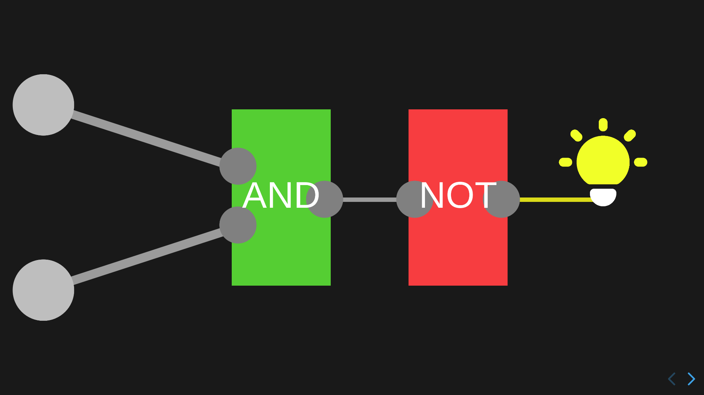
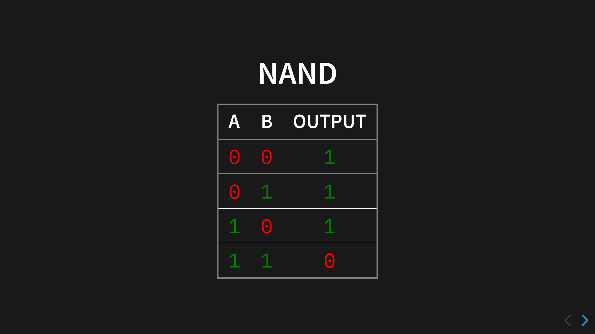
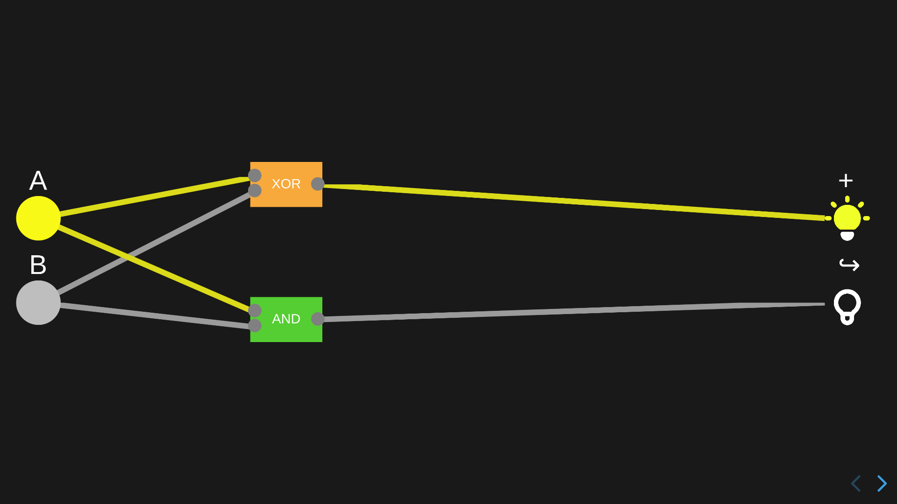
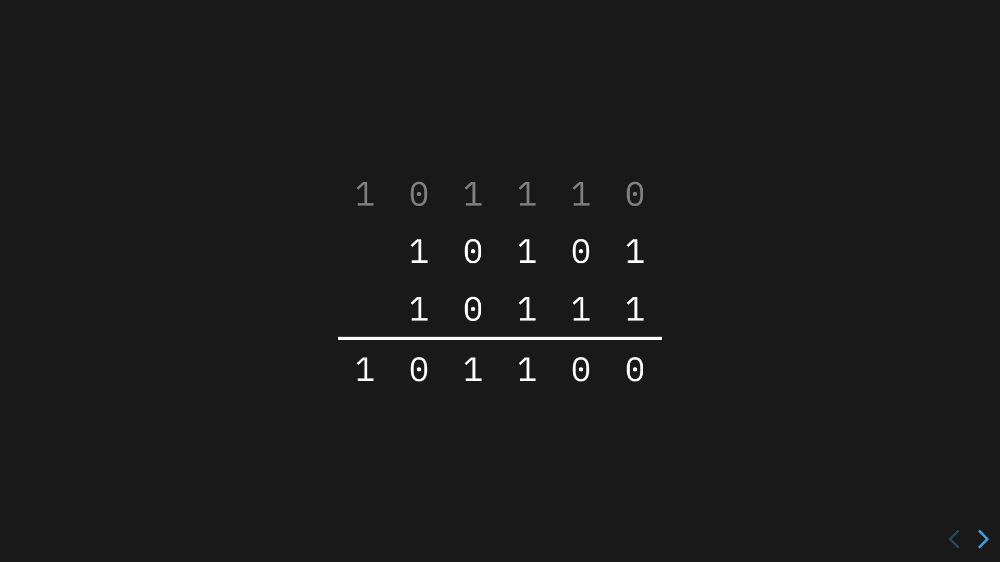
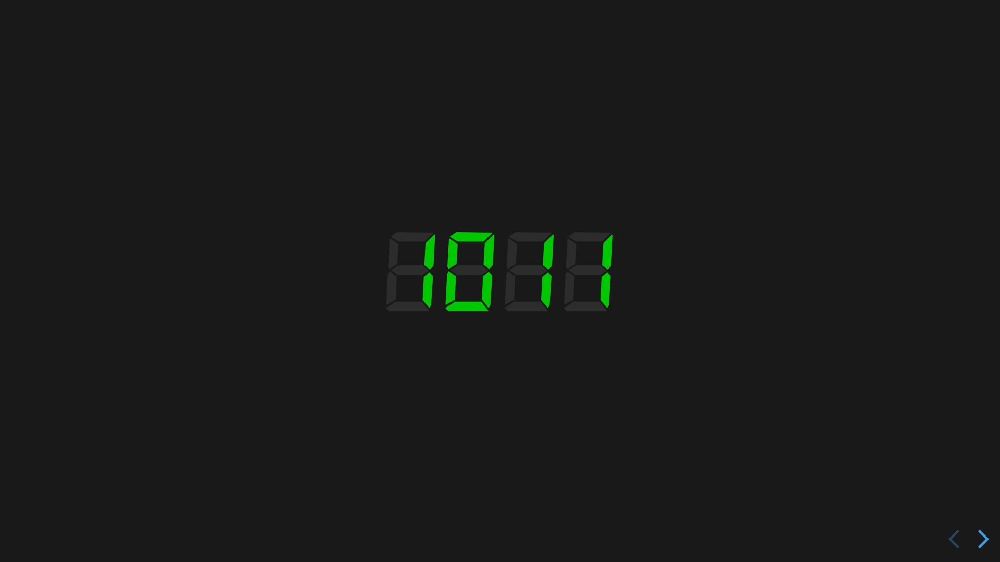

# Od mědi ke kalkulačce

## *(From copper to a calculator)*

An interactive presentation

---

## Languages?

This is a presentation I made for school originally in Czech, and I later translated into English.

You can choose between the two languages before starting the presentation, although the speaker notes are only available in Czech.

## What's it about?

The goal of this presentation is to demonstrate how to construct logic gates using simple electronic components and then combine them to create a basic 4-bit adder, while explaining the underlying logic. It also features an interactive simulation of the components. The concept is heavily inspired by [this amazing video](https://www.youtube.com/watch?v=QZwneRb-zqA) by Sebastian Lague.

## Screenshots

## Running the presentation

### A. Run from a release

1. [Download the latest release](https://github.com/TriLinder/PrezentaceOdMediKeKalkulacce/releases/latest)

2. Run your web server of choice inside the directory

3. Open the site in your browser

### B. Run from source

1. Clone this repository

2. Install the required packages (via `npm install` or `yarn install`)

3. Run the dev server (`npm run dev` or `yarn run dev`)

4. Open the site in your browser

This presentation is confirmed to work with Firefox `v134.0.2` and Chromium `v132.0.6834.110`.
